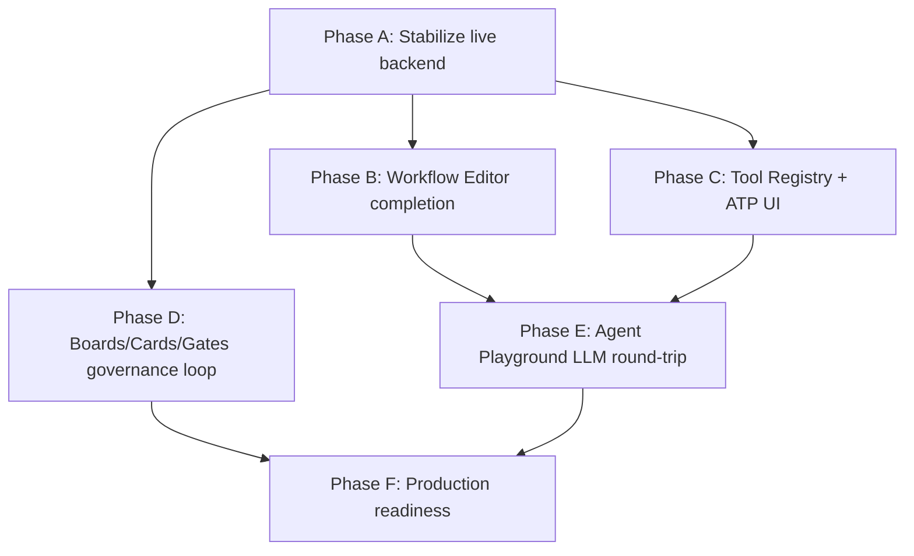

# AirAIE Feature Completion Plan

> Generated 2026-04-25 from a live audit of the codebase, not the docs.
> Scope: `airaie_platform/frontend/` (active SPA), `airaie-kernel/` (Go gateway + Rust runner), `atp/` (tool protocol), `airaie-mcp-server/`.
> Studios under `studios/` are abandoned and explicitly excluded.

---

## 1. Executive Summary

The platform has a strong **backend skeleton** (≈140 registered REST routes, ~21k lines of handlers, full Postgres schema across 26 migrations, working NATS dispatch, MinIO artifact pipeline, Anthropic + OpenAI-compat LLM providers wired) and a **partial unified frontend** (30 pages routed, AppShell + journey palette finished, all `MOCK_*` constants and `apiOrMock` removed). Phases 1–4 of the v2 roadmap are reported closed but Phase 4 (Workflow Runs) was demonstrably broken against live backend until the 2026-04-25 mapper fix (`260425-e2a`); other workflow pages still ship hardcoded fixture data behind `TODO(backend)` markers.

The gap is concentrated in three places:

1. **Workflow Editor / Detail / List**: still rendering `WORKFLOWS` and `WORKFLOW` const fixtures with `wf_demo_fea`, `wf_cfd_analysis`, `wf_demo` IDs (`pages/WorkflowsPage.tsx:39-150`, `pages/WorkflowDetailPage.tsx:52-583`). DSL deserialisation (`workflow.versions[0].dsl` base64 JSON → ReactFlow nodes/edges) is **not implemented** — the editor cannot read an existing workflow.
2. **Phases 5–7 not started**: Agent Playground page (1138 lines) is rendering, but its inspector + chat plumbing depends on tool-aware LLM proposals that are partially backend-side; Tool Registry page (536 lines) calls `useToolList` but the detail/contract/version sub-flows are unverified; Phase 7 (cross-cutting polish) untouched.
3. **Boards / Cards / Gates UI** (CreateBoardPage 1257 lines, BoardDetailPage 784 lines) was scaffolded and has handler routes (`boards`, `gates`, `intents`, `cards`, `evidence`, `intelligence`, `composition`, `templates`, `fork`, `portfolio`, `assist`) but no end-to-end test exists that the governance loop runs through the UI; `/v0/agents` linkage on cards is explicitly stubbed (`CreateBoardPage.tsx:81,750`).

### Completion estimates (read from code, not docs)

| Subsystem | Frontend | Backend | Integration | Overall |
|-----------|----------|---------|-------------|---------|
| Auth / RBAC | 85% | 70% (no project auto-attach, in-memory `prj_default` fallback) | 60% | **70%** |
| Dashboard | 95% | 90% | 85% | **90%** |
| Workflows (list/detail/editor) | 50% (hardcoded data, no DSL parse) | 90% | 40% | **55%** |
| Workflow Runs | 85% (post-260425-e2a) | 85% (no `/retry` route) | 75% | **80%** |
| Boards / Cards / Gates | 60% (UI present, untested loop) | 85% | 50% | **65%** |
| Intents / IntentSpec UI | 30% (no card→spec wiring UI) | 80% | 25% | **45%** |
| Agent Playground | 65% (UI scaffolded, no LLM provider config UI) | 80% (LLM providers wired in `internal/agent/`) | 55% | **65%** |
| Tool Registry | 55% (list works, contract viewer + manifest validator missing) | 95% | 60% | **70%** |
| ATP | n/a | 95% (8 live tools, SDK + MCP server) | 95% | **95%** |
| Artifacts | 70% (page exists) | 95% | 75% | **80%** |
| Approvals | 75% | 80% | 70% | **75%** |
| Real-time / SSE / WS | 70% (`useSSE`, `executionStore`) | 65% (events publish on `events.{runID}`, no JetStream durability) | 60% | **65%** |
| Observability / Audit | 30% (no audit log viewer, no cost dashboard) | 80% (`/v0/audit/events`, `/v0/audit/export`) | 25% | **45%** |

**Top 5 highest-leverage moves:**

1. Implement DSL → ReactFlow deserialisation in `WorkflowEditorPage` and remove `WORKFLOWS`/`WORKFLOW` const fixtures from `WorkflowsPage` / `WorkflowDetailPage` / `GlobalSearch` (single bug class, 4 sites).
2. Auto-attach freshly registered users to a default project membership (`/v0/auth/register` currently leaves users with zero memberships → 403 on every subsequent call). One service+migration change.
3. Wire the Tool Registry detail page (`ToolDetailPage`, 836 lines) to `/v0/tools/{id}/versions` + `/v0/tools/{id}/runs` + a contract viewer for the ATP manifest. The data shape is already produced by 8 live ATP tools.
4. Run the Phase 7 governance loop through the UI end-to-end: create a board → seed cards → propose plan → run pipeline → produce evidence → evaluate gate → approve. Every leg has handlers; no test confirms the user can complete the journey from the UI.
5. Implement Agent Playground LLM proposal panel: backend has `internal/agent/llm.go` with Anthropic + OpenAI-compat providers and `session.go` carries decision traces; the frontend `InlineToolCallCard` is rendered but no live message round-trip has been demonstrated.

---

## 2. Audit Findings — Frontend

Source root: `/Users/santhosh/airaie/airaie_platform/frontend/src/`.
Routes registered in `App.tsx:60-110`. Auth/protected routes wrap everything except the four auth pages.

### 2.1 Pages inventory

| Page (file) | Route | Status | Hooks/API | Notes |
|---|---|---|---|---|
| `DashboardPage.tsx` (70 ln) | `/dashboard` | **Live** | `useDashboard` → `dashboard.ts` (4 widgets) | All four widgets live against `/v0/runs`, `/v0/workflows`, `/v0/agents`, `/v0/boards` aggregations after 04-25 mock removal. |
| `WorkflowsPage.tsx` (587 ln) | `/workflows` | **Wired-broken** | `WORKFLOWS` const at line 39 — still hardcoded | Page is 8 fake `wf_demo_fea`/`wf_cfd_analysis`/`wf_material_testing`/etc. IDs. `TODO(backend): wire to /v0/workflows`. |
| `WorkflowDetailPage.tsx` (693 ln) | `/workflows/:id` | **Stub** | `WORKFLOW` const at line 55 (`wf_demo`) | Whole detail panel is fake. Comment at line 52 admits it. Agent-binding section at line 583 hidden behind another TODO. |
| `WorkflowEditorPage.tsx` (129 ln) | `/workflow-studio[/:workflowId]` | **Wired-broken** | `useWorkflow(workflowId)` — DSL parse missing | Uses real workflow record but cannot deserialize `dsl` (base64 JSON) into ReactFlow `nodes[]` / `edges[]`. Editor renders empty canvas for any non-new workflow. |
| `WorkflowRunsPage.tsx` (309 ln) | `/workflow-runs[/:runId]` | **Live** | `useRuns`, `fetchRunDetail`, `fetchRunLogs` | Fixed 2026-04-25 (260425-e2a). Renders 37 real runs against `wf_737cd510`. SSE streams logs via `executionStore`. |
| `WorkflowEvalPage.tsx` (412 ln) | `/workflows/:id/eval` | **Stub** | None | "Extremely rudimentary mockup chart via SVG/DOM" comment line 367. |
| `AgentsPage.tsx` (210 ln) | `/agents` | **Live** | `useAgents` → `/v0/agents` | List-style page, works. |
| `AgentStudioPage.tsx` (1138 ln) | `/agent-studio[/:agentId]` | **Wired-broken** | `useAgents`, `useAgentEvals`, version mgmt | Massive file. Edit/version/publish leg is partial. |
| `AgentPlaygroundPage.tsx` (lazy, ≈600 ln) | `/agent-playground[/:agentId]` | **Wired-broken** | `useAgentPlayground`, `agentPlayground.ts` | Sessions create/list/get verified. Tool-call proposals + decision trace surfaces only render when `_decision_trace` arrives in `context`. No LLM provider config UI; assumes the kernel was started with provider env vars. |
| `BoardsPage.tsx` (363 ln) | `/boards` | **Live** | `useBoards` | List works. |
| `BoardDetailPage.tsx` (784 ln, fullscreen) | `/boards/:boardId` | **Wired-broken** | `useBoards`, `useCards`, `useGates`, `useIntents`, `usePlans`, `usePinnedData` | Canvas-style board; renders, but the full governance loop (intent→plan→run→evidence→gate→approve) has no observed end-to-end happy path. |
| `CreateBoardPage.tsx` (1257 ln) | `/boards/create` | **Wired-broken** | `useBoards`, `useIntents`, vertical/intent-type picker | Comments at 81 & 750 acknowledge the agent picker is empty pending `/v0/agents` linkage. |
| `BoardStudioPage.tsx` (5 ln) | n/a | **Stub** | none | 5-line shell — leftover from studio-era. |
| `ToolRegistryPage.tsx` (536 ln) | `/tools` | **Live (partial)** | `useToolList` → `/v0/tools` | Grid renders. Filter sidebar wired client-side. No backend filter pushdown. |
| `ToolDetailPage.tsx` (836 ln) | `/tools/:id` | **Wired-broken** | `useTools` | Manifest/contract viewer panels exist but version history (`/v0/tools/{id}/versions`) and runs (`/v0/tools/{id}/runs`) integration not verified. Agent reverse-lookup hidden behind TODO at line 585. |
| `RegisterToolPage.tsx` (644 ln) | `/tools/register` | **Wired-broken** | `RegisterToolModal` form | UI exists. Submission to `POST /v0/tools` un-tested against ATP manifest validator (`POST /v0/validate/contract`). |
| `ToolsPage.tsx` (161 ln) | n/a (orphan) | **Stub** | — | Older tool list view; not linked from sidebar. |
| `ArtifactsPage.tsx` (556 ln) | `/artifacts` | **Live** | `/v0/artifacts` | Listing + download presigned URL flow appears to work. |
| `ApprovalsPage.tsx` (516 ln) | `/approvals` | **Live** | `useApprovals`, `useApproveApproval`, `useRejectApproval` | Polled list of pending approvals. |
| `IntegrationsPage.tsx` (209 ln) | `/integrations` | **Stub** | none | UI scaffold only. |
| `CapabilitiesPage.tsx` (57 ln) | `/capabilities` | **Stub** | (likely `useCapabilities`) | Backend has `/v0/capabilities` CRUD; UI minimal. |
| `CommunityPage.tsx` (235 ln) | `/community` | **Stub** | None visible | Static. |
| `ParametricLogicPage.tsx` (19 ln) | `/parametric` | **Stub** | None | Placeholder. |
| `ProfilePage.tsx` (417 ln) | `/profile` | **Wired-broken** | Auth context | Recent Activity timeline empty until `/v0/audit/user/:id` exists (TODO line 16). |
| `ReleasePacketPage.tsx` (356 ln) | `/release-packet` | **Stub** | none | Concept screen. |
| `LoginPage.tsx` (282 ln) | `/login` | **Live** | `AuthContext` → `/v0/auth/login` | Working. |
| `RegisterPage.tsx` (352 ln) | `/register` | **Live** | `/v0/auth/register` | Works, but new accounts have **zero project memberships**, breaking subsequent calls (see Section 2.3). |
| `ForgotPasswordPage.tsx` / `ResetPasswordPage.tsx` | `/forgot-password`, `/reset-password` | **Wired-broken** | `/v0/auth/...` | UI present; backend mailer not in this audit. |

**Routes referenced but not present:** `/audit-log` (no page), `/cost-dashboard` (no page), `/yaml-import` (no page) — all part of the deferred "X2 sprint."

### 2.2 Real-time integration

| Mechanism | Backend | Frontend | Status |
|---|---|---|---|
| SSE per-run | `GET /v0/runs/{id}/stream` (`handler/runs.go`) emits NATS-fanned events | `hooks/useSSE.ts` (153 ln) + `executionStore` (236 ln) | **Working** for `WorkflowRunsPage` log tab, used by `260425-e2a`. Event types poorly typed on frontend. |
| WebSocket | `GET /v0/ws` (`handler/websocket.go`, 92 ln) | None observed | **Backend-only.** Frontend never opens. Probably dead code or future-use. |
| NATS publish (server side) | `events.{runID}` (`runtime.go:413`), `airaie.approvals.*` (`runtime.go:736`), `SubjectJobDispatch` (line 572) | n/a | Approvals listener is in-process subscription, not durable. |
| NATS JetStream durability | **Not configured.** Restart loses in-flight messages. | n/a | Tracked as backlog item #15 (handoff). |
| Notifications inbox | **Missing endpoint** `/v0/notifications` | `NotificationCenter.tsx` ships empty state with `TODO(backend)` (line 37) | Stub on both sides. |
| Global search | **Missing endpoint** | `GlobalSearch.tsx:43` TODO | No backend search index. |

### 2.3 Known issues observed in code

1. Hardcoded workflow IDs (`STATE.md` blocker list): `WorkflowEditorPage.tsx`, `WorkflowDetailPage.tsx:55`, `WorkflowsPage.tsx:43-150`, `GlobalSearch.tsx`. `wf_fea_validation` mentioned in handoff persists in some tests.
2. `client.ts:38` defaults `X-Project-Id: prj_default` for all calls — masks RBAC failures for non-default projects.
3. Mock token paths (`client.ts:28,59`) still ignore tokens prefixed `mock-`. Harmless but signals incomplete cleanup.
4. `safeArray` removed from `dashboard.ts` (per handoff) — good — but other api files have not been verified for similar swallowing patterns.
5. `agentPlayground.ts:188-209` admits *only iteration count* has a real source for `LiveMetrics`; `totalCost`, `budgetRemaining`, `duration`, `timeout` are all `null`. The Inspector renders blanks.
6. `runs.ts:177` `attempts: []` — attempt-history endpoint not yet implemented in kernel.
7. `runs.ts:158-164` `cpuPercent: 0`, `memoryMb: 0` — not exposed on the wire today.
8. `client.ts` 401 handler force-redirects to `/login`, bypassing `AuthContext` cleanup. Will cause UX flicker.

---

## 3. Audit Findings — Backend

Source root: `/Users/santhosh/airaie/airaie-kernel/`.
Entry point: `services/api-gateway/main.go` (single file, ~700 ln). Routes registered via `internal/handler/handler.go:127` `RegisterRoutes`.

### 3.1 Endpoints inventory (representative subset; ~140 routes total)

| Subsystem | Endpoints | Handler | Status | Service backing | DB/external |
|---|---|---|---|---|---|
| Health/Version | `GET /v0/health`, `GET /v0/version`, `GET /metrics` | inline | **Production** | n/a | Postgres ping, NATS conn |
| Auth | `POST /v0/auth/{register,login,refresh,logout}`, `/v0/me` | `auth.go` (RegisterRoutes) | **Functional** | `auth.AuthService` | Postgres `users`, `refresh_tokens` |
| Tools CRUD | `POST/GET/PUT/DELETE /v0/tools[/{id}]`, `/v0/tools/{id}/runs`, versions, publish, deprecate, trust-level (`handler.go:130-147`) | `handler.go` + `tool_sdk.go` | **Production** | `service.Service` (tools), `registry.go` | `tools`, `tool_versions`, `manifests` |
| Builds | `POST /v0/builds`, `GET /v0/builds/{id}`, log stream | `build.go` (303 ln) | **Functional** | `service.build`, `kaniko.go` | Kaniko jobs, MinIO logs |
| Validate | `POST /v0/validate/contract`, `POST /v0/tools/.../validate-inputs` | `validation.go` (122 ln) | **Functional** | `validator/` package | none |
| Capabilities | `POST/GET/DELETE /v0/capabilities[/{id}]`, search | `capabilities.go` (102 ln), `capability_routes.go` | **Functional** | `service/capability.go` | `capabilities`, `domain_registry` |
| Runs | `POST /v0/runs`, `GET /v0/runs[/{id}]`, cancel, resume, checkpoints, logs, events, artifacts, trace, stream | `runs.go` (512 ln), `sse.go`, `run_trace.go` | **Functional** | `service/run.go` (output_uploads persistence in place) | `runs`, `node_runs`, `run_events`, MinIO outputs, NATS `events.{id}` |
| Workflows | `POST /v0/workflows[/compile,/validate,/plan]`, CRUD, versions, publish, run | `workflows.go` (436 ln) | **Functional** | `service/workflow.go` | `workflows`, `workflow_versions` |
| Triggers | `POST/GET/PATCH/DELETE /v0/workflows/{id}/triggers[/{tid}]` | `triggers.go` (163 ln) | **Functional** | `service/trigger.go` | `triggers` |
| Artifacts | `POST /v0/artifacts/upload-url`, `/{id}/finalize`, GET list/detail, `/download-url`, lineage, convert | `artifacts.go` | **Production** | `service/artifact.go` | MinIO presigned URLs, Postgres `artifacts`, `artifact_lineage` (table exists, lineage writes incomplete — backlog #18) |
| Agents | `POST/GET/DELETE /v0/agents[/{id}]`, versions, validate, publish, run, sessions CRUD, memories, evals, triggers, messages, approve | `agents.go`, `agent_runs.go`, `agent_sessions.go`, `agent_memory.go`, `agent_evals.go`, `agent_messages.go`, `agent_triggers.go`, `agent_eval_runner.go`, `multi_agent.go` | **Functional** | `service/agent.go` | `agents`, `agent_versions`, `agent_sessions`, `agent_memory` (pgvector), `agent_eval_cases` |
| Boards | `POST/GET/PATCH/DELETE /v0/boards[/{id}]`, children, records, attachments | `boards.go` (479 ln), `board_summary.go`, `board_template.go`, `board_fork.go`, `board_intelligence.go`, `board_composition.go`, `board_mode.go`, `board_portfolio.go`, `board_assist.go` | **Functional** | `service/board.go` and 9 siblings | `boards`, `board_records`, `board_attachments`, templates, intelligence cache |
| Cards | `POST/GET/PATCH/DELETE /v0/boards/{boardId}/cards[/{id}]`, dependencies, transitions | `card.go` (572 ln) | **Functional** | `service/card.go` | `cards`, `card_dependencies` |
| Gates | `POST/GET /v0/gates`, requirements, evaluate, approve/reject/waive, approvals list | `gates.go` (459 ln) | **Functional** | `service/gate.go`, `evaluators.go`, `evidence_collector.go` | `gates`, `gate_requirements`, `gate_evaluations`, `gate_approvals`, `evidence` |
| Verticals/Intent types | `GET /v0/verticals[/{slug}]`, board-types, gate-types, req-types, record-types; `GET /v0/intent-types[/{slug}/{inputs,pipelines}]` | `verticals.go`, `intent_types.go` | **Production** | `service/type_registry.go` | `verticals`, `board_types`, `intent_type_definitions` |
| Intents (IntentSpecs) | `POST/GET/PATCH/DELETE /v0/boards/{boardId}/intents[/{id}]`, lock | `intents.go` (147 ln) | **Functional** | `service/intent.go` | `intents` |
| ToolShelf | `POST /v0/toolshelf/resolve`, recommendations | `toolshelf.go` (302 ln) | **Functional** (governance hooks return `true` stubs at `service/toolshelf.go:323-339`) | `service/toolshelf.go`, `service/resolution.go` | reads tools+capabilities |
| Pipelines | CRUD `/v0/pipelines` | `pipeline.go` (179 ln) | **Functional** | `service/registry.go` | `pipelines` |
| Plans | `POST /v0/boards/{id}/plans`, get, regenerate | `plan.go` (273 ln) | **Functional** | `service/plan_compiler.go`, `plan_generator.go` | `execution_plans` |
| Evidence | `evidence.go` (17 ln stub-ish) + handlers spread elsewhere | `evidence.go` | **Stub-functional** | `service/evidence_collector.go` (uses `metric_extractor.go`) | `evidence`, `evidence_automation` |
| Templates | `GET/POST /v0/templates`, apply | `templates.go` (93 ln) | **Functional** | `service/template.go` | `board_templates`, `workflow_templates`, `agent_templates` |
| Quotas | `GET /v0/quotas` | `quotas.go` (32 ln) | **Functional** | `service/quota.go` | `quotas` |
| Audit | `GET /v0/audit/events`, `GET /v0/audit/export` | `audit_events.go`, `audit_export.go` | **Functional** | `service/audit.go` | `audit_events` |
| Policies | CRUD `/v0/policies` | `policies.go` (108 ln) | **Functional** | `service/governance_policy.go` | `policies` |
| Approvals | `approval.RegisterApprovalRoutes` (separate from gate approvals) | `approvals.go` | **Functional** | `service/approval.go` | `approval_requests` |
| Cost tracking | `cost_tracking.go` (98 ln) | **Functional** | `service/cost_tracking.go` | per-run cost |
| Multi-agent | `multi_agent.go` (210 ln) | **Functional** | `service/multi_agent.go` | coordination tables |
| Trust level | `PATCH /v0/tools/.../trust-level`, validators | `trust_level.go` | **Functional** | `service/trust_updater.go` | `tool_versions.trust_level` |
| Explain | `GET /v0/runs/{id}/explain` | `explain.go` (23 ln) | **Functional** | `service/explain.go` | reads `run_events`, decision traces |
| DLQ | dead-letter queue admin | `dlq.go` (83 ln) | **Functional** | NATS DLQ subject | |
| WebSocket | `GET /v0/ws` | `websocket.go` (92 ln) | **Wired** but no frontend client | |
| Dashboard aggregation | `GET /v0/dashboard/...` | `dashboard.go` (465 ln) | **Production** | reads multiple stores | |

**Gaps / missing routes referenced by frontend code:**

- `POST /v0/runs/{id}/retry` — referenced; **not registered**. (`runs.ts:260` documents the absence; restart goes via `/v0/workflows/{id}/run`.)
- `GET /v0/notifications` — referenced; missing.
- `GET /v0/audit/user/:id` — referenced; missing.
- `GET /v0/workflows/{id}/agents` — agent ↔ workflow reverse lookup; missing.
- `GET /v0/tools/{id}/agents` — missing.
- Cross-entity search — missing.

### 3.2 NATS / MinIO / runner integration

- **NATS subjects in use:**
  - `airaie.jobs.dispatch` (Go const `SubjectJobDispatch`, runtime.go:572) — runner queue-subscribes (`runner/src/nats/consumer.rs:73-84`).
  - `events.{runID}` — fanout for SSE (`runtime.go:413`).
  - `airaie.approvals.*` — in-process approval listener (`runtime.go:736-765`).
- **No JetStream durability.** Backlog #15. Restart loses pending work.
- **MinIO:** presigned upload + `/finalize` flow validated end-to-end across 8 ATP tools. Runner SHA-256s outputs, kernel finalises with content-hash immutability check (`service/artifact.go`, `ErrArtifactAlreadyFinalized`).
- **Runner enforcement** of `resources.memory_mb` / cpu **not verified** (backlog #17).
- **`artifact_lineage`** table exists (migration 022 `node_run_outputs`); **lineage edges are not consistently written** (backlog #18). `GET /v0/artifacts/{id}/lineage` will return empty graphs for live runs.
- **LLM providers wired:** `internal/agent/llm.go` factory selects `anthropic` (`llm_anthropic.go`, model `claude-sonnet-4-6`), `openai`, `groq`, `ollama`, `vllm`, `litellm`, `together`, `fireworks` (all OpenAI-compat at `llm_openai_compat.go`). Provider chosen via env config in `internal/config/config.go:48`. **No UI to set the active provider** — operators must set env vars before gateway start.
- **Tool-aware sessions:** `internal/agent/session.go:379` switches on `anthropic`/`openai` provider strings for tool-call schema mapping. Decision trace produced into `context._decision_trace` (consumed by frontend `extractDecisionTrace`).

### 3.3 ATP tools shipped

Source: `/Users/santhosh/airaie/atp/examples/`. Confirmed via run scripts that produced real `art_xxx` IDs.

| Tool | Image | Status | Trust | Notes |
|---|---|---|---|---|
| hello-world | `atp-hello:0.1` | live | community | Smoke test, no I/O |
| cli-stats | (cli binding) | live | community | Word/byte stats |
| calculix-beam | `atp-calculix:2.20` | live | tested | 8 hex / 36 nodes, max disp 6.36 μm |
| ngspice-circuit | `atp-ngspice:0.1` | live | tested | 52-row AC sweep, requires tmpfs/64MB |
| frd-summary | `atp-frd-summary:0.1` | live | tested | Pipeline successor: consumes CalculiX `.frd` |
| gmsh-mesh | `atp-gmsh:0.1` | live (today) | community | Geometric meshing |
| sklearn-classifier | `atp-sklearn:0.1` | live (today) | community | ML demo |
| openfoam-cavity | `atp-openfoam:11` | live (today) | community | CFD; runs amd64 emulation on arm64, ~20s |

`atp-sdk` Python wheel built (`dist/atp_sdk-0.1.0-py3-none-any.whl`); not yet on PyPI. `airaie-mcp-server` npm package validated; not yet on npm.

---

## 4. Subsystem Completion Matrix

### 4.1 Workflows

- **Done:** Backend CRUD, versioning, publish, validate, compile, plan, run-by-id (`handler/workflows.go`). Workflow Runs page renders 37 real runs, SSE log streaming via `executionStore`, status mapping in `runs.ts`. Triggers CRUD complete.
- **Gap (UI):** WorkflowsPage list is fixture; WorkflowDetailPage is fixture; WorkflowEditorPage cannot deserialize DSL → ReactFlow nodes (canvas blank for existing workflows); no expression editor; no version-management UI; no workflow→agent binding view; eval page is mock chart.
- **Gap (API):** `/v0/runs/{id}/retry` missing; `/v0/workflows/{id}/agents` missing; attempt-history endpoint missing; per-node CPU/memory metrics not on the wire.
- **Gap (runtime):** Triggers fire (`postgres_triggers.go`) but cron scheduler durability untested.
- **Risks:** DSL schema is the bottleneck. Without a published canonical DSL JSON shape, frontend cannot round-trip.

### 4.2 Boards / Cards / Gates

- **Done:** Backend has full vertical board ontology (`verticals`, `board_types`, `gate_types`, `req_types`, `record_types`), 9 services, gate evaluator + evidence collector, fork/replay/portfolio/assist/intelligence services. Migrations 002–019 cover the schema.
- **Gap (UI):** CreateBoardPage 1257 ln but agent-picker is empty stub. BoardDetailPage 784 ln renders but full governance loop (intent → plan → run → evidence → gate evaluate → approve) has no observed end-to-end happy path. Card detail rich rendering (the **superseded** "Canva-style" mission) is not implemented in the unified frontend; cards render as list items only.
- **Gap (API):** None major; handlers exist for the entire loop. Evidence auto-collection wires (`evidence_automation` migration 014) need cross-cutting integration test.
- **Gap (integration):** IntentSpec → card linkage UI missing. Plan generator works but no UI for re-plan; replay only via API.
- **Risks:** Evidence auto-collection silently no-ops when run outputs are missing keys — needs canary test per pipeline.

### 4.3 Agents

- **Done (backend):** Full agent model: agents, versions, sessions, memories (pgvector via migration 017), eval cases (migration 026), triggers, messages, approvals, multi-agent coordination. LLM providers wired. Decision trace captured.
- **Done (frontend):** AgentsPage list, AgentStudioPage edit/version, AgentPlaygroundPage with Inspector (DecisionTraceTimeline, LiveMetrics, PolicyStatusCard) and ActionBar.
- **Gap (UI):** No provider config UI (env-only); LiveMetrics only populates iterations; tool-call proposal cards (`InlineToolCallCard`) untested in live message round-trip; eval-runner UI not exposed; multi-agent coordination has zero UI.
- **Gap (API):** `/v0/agents/{id}/runs/{runId}/explain` works but no UI consumer.
- **Risks:** Provider failures bubble up as opaque 500s — frontend has no provider-status indicator.

### 4.4 Tools

- **Done (backend):** 21 tools registered via ATP bridge, `/v0/tools` slow but functional, contract validator, manifest validator, trust level updater, build via Kaniko, registries CRUD.
- **Done (frontend):** ToolRegistryPage grid with `useToolList`. RegisterToolPage modal exists.
- **Gap (UI):** ToolDetailPage version history + manifest contract viewer unverified; manifest validator not surfaced as inline form helper; trust-level UI absent; no test-run trigger; agent reverse-lookup hidden behind TODO.
- **Gap (perf):** First `/v0/tools` call ~15-30s on warm DB (handoff Section "Critical gotchas"). Pagination not implemented frontend-side.

### 4.5 ATP

- **Done:** ATP-SPEC v0.2 ratified, Python SDK packaged, MCP server packaged, 8 live tools, kernel bridge idempotent, runner stages inputs at `/in/<port_name>` (no extension), tmpfs auto-mounted, output SHA-256 + content-hash finalization.
- **Gap:** Python/Jupyter binding (#27) not started. Manifest validator (`POST /v0/validate/contract`) not surfaced in RegisterToolPage as live feedback.
- **Risks:** None major; this is the most mature subsystem.

---

## 5. Phase Plan to Complete

### Phase A — Stabilize live backend wiring (Owner: full-stack, Effort: M)

**Goal:** Eliminate every hardcoded fixture and shape mismatch surfaced now that mocks are off.

1. Replace `WORKFLOWS` fixture in `pages/WorkflowsPage.tsx:39-150` with `useWorkflows()` (new hook over `GET /v0/workflows`). Empty-state included.
2. Replace `WORKFLOW` fixture in `pages/WorkflowDetailPage.tsx:55` with `useWorkflow(id)`.
3. Remove `wf_fea_validation` strings from `WorkflowEditorPage.tsx`, `GlobalSearch.tsx`, any test fixtures (4 sites per `STATE.md`).
4. Backend: register `POST /v0/runs/{id}/retry` thin wrapper that re-invokes `RunService.StartRun` with prior inputs (or document deprecation in API contract).
5. Backend: implement project auto-attach in `auth.AuthService.RegisterUser` — create or join a `prj_default` membership in same transaction. Add migration `027_auto_attach_default_project.sql` if needed.
6. Frontend: stop sending hardcoded `X-Project-Id: prj_default` from `client.ts:38`; read from auth claims.
7. Frontend: remove `mock-` token short-circuits in `client.ts:28,59`.
8. Backend: stub `GET /v0/notifications` returning `{ items: [] }` (well-typed empty); same for `GET /v0/audit/user/{id}`. Lets bell + profile timeline render without TODOs.

**Dependencies:** none.
**Success:** TypeScript `npx tsc --noEmit` clean; manual click-through of `/workflows`, `/workflows/:id`, `/workflow-runs`, `/profile`, bell — zero console errors; new account can call any `/v0/*` endpoint without 403.

### Phase B — Workflow Editor completion (Owner: frontend + backend, Effort: L)

**Goal:** Editor reads, edits, and writes a real workflow DSL.

1. Define canonical DSL JSON schema (one source of truth). Place at `airaie_platform/doc/implementation/new_design/WORKFLOW_DSL.md`. Coordinate with `service/workflow.go` `Compile` / `Validate`.
2. Implement `dslToFlow(dsl: WorkflowDSL): { nodes: Node[]; edges: Edge[] }` and inverse `flowToDsl(...)` in `frontend/src/utils/workflowDsl.ts`. Cover all 6+1 node types (Trigger, Tool, Agent, Gate, Logic, Data, StickyNote).
3. Wire load/save/publish in `WorkflowEditorPage.tsx` — currently 129 ln stub.
4. Expression editor for parameter inputs (`ParameterInput.tsx` already accepts `{{ }}` placeholders) — autocomplete from upstream node outputs.
5. Version management UI panel (`/v0/workflows/{id}/versions` exists).
6. Backend: ensure `POST /v0/workflows/compile` returns granular per-node error envelope.

**Depends on:** Phase A (un-hardcoded data plumbing).
**Success:** Round-trip a workflow with 5 nodes incl. one Tool + one Gate; publish v1; run; runs page reflects.

### Phase C — Tool Registry + ATP UI (Owner: frontend, Effort: M)

**Goal:** A user can browse, inspect, and register a tool from the UI.

1. Wire `ToolDetailPage.tsx` version list → `/v0/tools/{id}/versions`; runs strip → `/v0/tools/{id}/runs`.
2. Build ATP manifest contract viewer panel (read manifest JSON, show ports + governance + bindings tabs).
3. Trust-level UI with `PATCH /v0/tools/{id}/versions/{v}/trust-level` (admin gate).
4. RegisterToolPage: live `POST /v0/validate/contract` on form blur with inline errors.
5. "Test run" button: `POST /v0/runs` with synthesized minimal inputs.
6. Backend: pagination + indexed search on `GET /v0/tools` to fix the 15-30s cold call.

**Depends on:** Phase A.
**Success:** Register a fresh ATP tool from UI alone (no curl); cold `/v0/tools` < 1s warm.

### Phase D — Boards/Cards/Gates governance loop UI (Owner: full-stack, Effort: L)

**Goal:** Complete the governance journey end-to-end through the UI.

1. CreateBoardPage: replace empty agent picker with `useAgents()` (lines 81, 750).
2. BoardDetailPage: implement IntentSpec creation modal (`POST /v0/boards/{boardId}/intents`).
3. Card → IntentSpec linkage UI (cards currently render but don't show their intent).
4. Plan generator integration: "Generate Plan" button → `POST /v0/boards/{id}/plans` → display ExecutionPlan DAG.
5. Pipeline execution from card; live status overlay using existing SSE.
6. Evidence panel: render `/v0/gates/{id}/evidence` results inline; show metric extraction outputs.
7. Gate evaluate / approve / reject / waive UI with rationale capture.
8. Cross-cutting: write `artifact_lineage` rows in `service/run.go` `handleResult` (closes backlog #18) — needed for evidence traceability.
9. Card detail "Canva-style" rich content (3D viewer, charts, tables) — **deferred until base loop is solid**; tracked separately.

**Depends on:** Phases A + B (workflow runs feed evidence).
**Success:** Demo: new user creates board → card → intent → plan → run → evidence → gate passes → approval recorded. All from UI.

### Phase E — Agent Playground LLM round-trip (Owner: full-stack, Effort: M)

**Goal:** A user sends a prompt; agent proposes a tool call; user approves; tool runs; result lands in chat.

1. Provider config UI (admin-only): set `agent.llm.provider`, model, base URL, API key. Persists to `internal/config/config.go` runtime override.
2. Tool-call proposal card (`InlineToolCallCard.tsx`) — verify rendering with real `_decision_trace`.
3. Approve / reject flow on proposal card → `POST /v0/agents/{id}/sessions/{sid}/approve`.
4. RunOutputsPanel (`components/agents/execution/RunOutputsPanel.tsx`) — already preserved per `runs.ts:264` — verify it renders post-run artifacts.
5. LiveMetrics: surface real cost/duration/budget. Backend: ensure session aggregates these (currently `null` per `agentPlayground.ts:201-209`).
6. Eval runner UI: `POST /v0/agents/{id}/evals/run` with results grid.
7. Backend: provider health check endpoint (`GET /v0/agents/llm/health`) returning chosen provider + last-error.

**Depends on:** Phase A (auth membership), Phase C (tool catalog clean).
**Success:** Live demo: prompt "summarise this CSV" → agent picks `atp-cli-stats` → user approves → output appears in chat.

### Phase F — Production readiness (Owner: full-stack, Effort: L)

**Goal:** Platform survives chaos, audits, and a real second user.

1. NATS JetStream: convert `airaie.jobs.dispatch` to JetStream stream with durable consumers; replay on runner restart (backlog #15).
2. Runner resource enforcement test: deploy a "rogue" tool that allocates 4× declared `memory_mb`; runner kills it (backlog #17).
3. RBAC enforcement: replace `prj_default` fallback in `handler.go:662` with strict project membership check (#38). Add roles per migration 020.
4. HttpOnly cookie tokens (#39): backend issues `Set-Cookie`; frontend drops `localStorage` token.
5. Observability: add audit log viewer at `/admin/audit` (consume `/v0/audit/events`); cost dashboard at `/admin/cost`.
6. YAML import/export for workflows + boards (X2 sprint — deferred since MVP).
7. CSP header: already wired (per handoff). Verify with `curl -sI`.
8. Playwright E2E: zero today. Implement smoke: login → dashboard → create board → run pipeline.
9. Vitest coverage uplift on `frontend/src/api/*.ts` mappers (currently untested).

**Depends on:** Phases A–E.
**Success:** Restart gateway + runner mid-run, run completes; rogue tool gets OOM-killed; new user with `viewer` role cannot mutate; Playwright smoke green in CI.

---

## 6. Cross-cutting work

- **Lineage table writes (`artifact_lineage`)**: instrument `service/run.go` `handleResult.resolveOutputArtifacts` with edge inserts. Required by Phase D evidence traceability.
- **Evidence auto-collection wiring**: hook `evidence_collector.go` into the run-completed event; verify per-pipeline metric extraction (`metric_extractor.go`).
- **Project membership auto-attach**: see Phase A item 5.
- **Error envelope standardisation**: backend uses `ErrorResponse{Error:APIError}` (`handler.go:416`); frontend uses two distinct paths (`ApiError` class vs plain object). Pick one shape; document in `airaie_platform/doc/api-error-contract.md`.
- **Type sharing**: there is no shared schema between Go DTOs and TS types. Consider OpenAPI generation from `handler/*.go` route table or hand-curated `types/api.ts`.
- **Performance**: `/v0/tools` cold response 15-30s. Likely an N+1 over versions; profile and add a join.

---

## 7. Test Strategy

| Layer | Today | Needed |
|---|---|---|
| Go unit | `go test ./internal/...` ~60% by file count (handler tests + service tests visible) | Maintain; add `service/intent.go` (TODO at line 279), `service/toolshelf.go` governance stubs (lines 323-339) |
| Rust unit | `cargo test` in `runner/` | Coverage on adapter docker, sandbox, sha256 |
| ATP | `pytest` in `atp/` 37+ tests | Add OpenFOAM, Gmsh, sklearn smoke tests |
| Frontend unit | None visible in `airaie_platform/frontend/` | Mappers in `api/runs.ts`, `api/agentPlayground.ts` are pure functions — test them. Aim for 60% on `api/*.ts`. |
| Frontend integration | None | MSW + Vitest for hooks |
| E2E | **Zero** | Playwright: login, dashboard, workflow CRUD, run, board governance loop |

---

## 8. Open Decisions

1. **DSL canonical schema**: who owns it? Backend (`service/workflow.go` Compile) and frontend (editor) currently disagree.
2. **RBAC role model**: migration 020 adds trust + intents; role taxonomy not yet decided (`viewer`, `member`, `admin`, `owner`?).
3. **LLM provider default**: ship with Anthropic default? Document required env vars on first run?
4. **Replan-into-workflow**: re-plan triggers a new workflow run vs. patching an existing one — semantics undefined.
5. **Card detail rich rendering**: re-introduce the Canva-style mission post-Phase D, or treat as separate v3?
6. **Agent ↔ workflow binding**: where does this live in the data model? Currently no table. Required by `WorkflowDetailPage:583` TODO.
7. **PyPI / npm publishing**: `atp-sdk` wheel + `airaie-mcp-server` tarball built but not pushed. Awaiting credentials.

---

## 9. Appendix — File reference

### Phase A (Stabilize)
- `airaie_platform/frontend/src/pages/WorkflowsPage.tsx:39-150`
- `airaie_platform/frontend/src/pages/WorkflowDetailPage.tsx:52-583`
- `airaie_platform/frontend/src/pages/WorkflowEditorPage.tsx:19`
- `airaie_platform/frontend/src/components/layout/GlobalSearch.tsx:43`
- `airaie_platform/frontend/src/api/client.ts:28,38,59`
- `airaie-kernel/internal/handler/handler.go:651-668` (project ID extraction)
- `airaie-kernel/internal/auth/` (RegisterUser flow)
- `airaie-kernel/internal/handler/runs.go` (add `/retry` route)

### Phase B (Workflow Editor)
- `airaie_platform/frontend/src/pages/WorkflowEditorPage.tsx`
- `airaie_platform/frontend/src/components/workflows/canvas/*`
- `airaie_platform/frontend/src/components/workflows/nodes/*`
- `airaie_platform/frontend/src/components/workflows/palette/*`
- `airaie_platform/frontend/src/components/workflows/ndv/ParameterInput.tsx`
- `airaie-kernel/internal/handler/workflows.go`
- `airaie-kernel/internal/service/workflow.go`

### Phase C (Tool Registry + ATP UI)
- `airaie_platform/frontend/src/pages/ToolDetailPage.tsx`
- `airaie_platform/frontend/src/pages/RegisterToolPage.tsx`
- `airaie_platform/frontend/src/components/tools/*`
- `airaie_platform/frontend/src/api/tools.ts`
- `airaie-kernel/internal/handler/tools.go`
- `airaie-kernel/internal/handler/validation.go`
- `airaie-kernel/internal/service/registry.go`
- `atp/src/atp/manifest.py`

### Phase D (Boards/Cards/Gates)
- `airaie_platform/frontend/src/pages/CreateBoardPage.tsx:81,750`
- `airaie_platform/frontend/src/pages/BoardDetailPage.tsx`
- `airaie_platform/frontend/src/components/boards/*`
- `airaie_platform/frontend/src/api/{boards,cards,gates,intents,plans}.ts`
- `airaie-kernel/internal/handler/{boards,card,gates,intents,plan,evidence}.go`
- `airaie-kernel/internal/service/{board,card,gate,intent,plan_compiler,plan_generator,evidence_collector,evaluators,metric_extractor}.go`
- `airaie-kernel/internal/service/run.go` (lineage write)

### Phase E (Agent Playground)
- `airaie_platform/frontend/src/pages/AgentPlaygroundPage.tsx`
- `airaie_platform/frontend/src/components/agents/{ChatInterface,ChatMessage,DecisionTraceTimeline,InspectorPanel,LiveMetrics,PolicyStatusCard,InlineToolCallCard,PlaygroundActionBar}.tsx`
- `airaie_platform/frontend/src/components/agents/execution/RunOutputsPanel.tsx`
- `airaie_platform/frontend/src/api/agentPlayground.ts`
- `airaie_platform/frontend/src/store/agentPlaygroundStore.ts`
- `airaie-kernel/internal/agent/{llm.go,llm_anthropic.go,llm_openai_compat.go,session.go,messages.go}`
- `airaie-kernel/internal/handler/{agents.go,agent_sessions.go,agent_messages.go,agent_runs.go}`
- `airaie-kernel/internal/service/agent.go`

### Phase F (Production)
- `airaie-kernel/runner/src/nats/consumer.rs` (JetStream)
- `airaie-kernel/runner/src/sandbox.rs` (resource enforcement)
- `airaie-kernel/internal/auth/` (RBAC)
- `airaie_platform/frontend/src/contexts/AuthContext.tsx` (cookie tokens)
- `airaie-kernel/infra/migrations/` (migration 027+ for project auto-attach, RBAC roles)
- New: `airaie_platform/frontend/e2e/` (Playwright)

---

End of plan.
