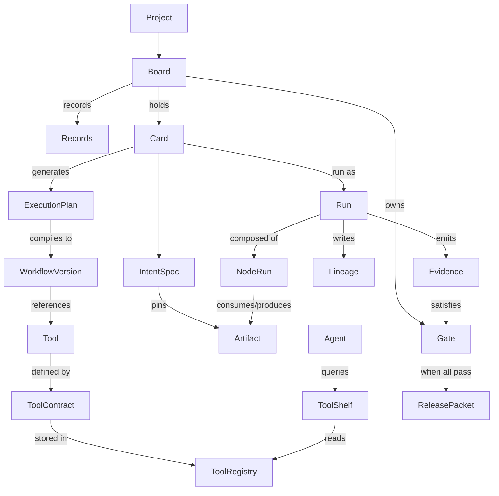

# AirAIE Platform — Comprehensive User Journey

> Audience: engineers and PMs joining the AirAIE project who need to understand the *user* perspective end-to-end — what a user actually does, what they see, what happens behind the scenes, and how the subsystems wire together.
>
> Source material: `AIRAIE_MASTER_SYSTEM_DOCUMENT.md`, the four subsystem architecture docs (Board / Workflow / Agent / Tool), `AIRAIE_COMPLETE_TOOL_FLOW_DOCUMENTATION.md`, `ATP-SPEC-v0.2.md`, and the `new_design/` set (`AIRAIE_TECHNICAL_ARCHITECTURE`, `AIRAIE_UNIFIED_STATE_AND_DATA_FLOW`, `AIRAIE_USER_SYSTEMS_GUIDE`, `AIRAIE_N8N_INSPIRED_DESIGN`).

---

## 1. Mental Model

AirAIE is a **governed experimentation platform** for engineers, scientists, and analysts. It is not a notebook, not a project tracker, not a chatbot. It is the infrastructure that takes a practitioner from *"I have a problem and some ideas"* to *"I have a validated, reproducible, approved result"* and makes that journey structured, traceable, and AI-assisted.

To use the platform productively, hold three planes in mind simultaneously:

| Plane | What it owns | Primary nouns |
|---|---|---|
| **Governance plane** | Why we are running anything, what success looks like, who signed off | Project, Board, Card, IntentSpec, Gate, Evidence, Record, Release Packet |
| **Orchestration plane** | The shape of a computation and the agent reasoning that produces a shape | Workflow, Workflow Version, Agent, AgentSpec, ExecutionPlan, Run, NodeRun |
| **Capability plane** | What can actually be invoked, the contract that describes it, and the data it consumes/produces | Tool, ToolContract (ATP manifest), Tool Registry, ToolShelf, Artifact, Lineage |

These planes correspond directly to the five-layer system stack in the master document: Governance, Intelligence, Execution, Data, and Infrastructure.

### The single visual canvas metaphor

The frontend (a single React 19 application at `airaie_platform/frontend/`, port 3000) presents this stack as **one n8n-inspired canvas** — `@xyflow/react` — instead of three separate studios. Engineers build hybrid workflows by dragging nodes onto a single canvas; the platform decides which nodes execute in-process, which dispatch to NATS, and which require human approval.

### The 6 canvas node types

| Node | Visual | What it represents to the user | Where it executes |
|---|---|---|---|
| **Trigger** | Lightning bolt, green border | "Start here when X happens" — manual run, schedule, webhook, board-card event | No execution; activates the run |
| **Tool** | Wrench, orange border | "Run this containerized capability" — FEA solver, mesh generator, classifier, postprocessor | Docker container via NATS → Rust runner |
| **Agent** | Brain, purple border, with `[M][T][P][Mem]` sub-ports | "Let an LLM-driven reasoner pick the next tool(s)" | Go agent runtime → LLM call → delegated tool runs |
| **Gate** | Shield, green/red | "Block until evidence or human signature is in" | In-process Go evaluation against DB state |
| **Logic** | Diamond (IF / Switch / Merge) | "Branch / converge data flow" | In-process Go conditional |
| **Data** | File icon (Upload / Transform) | "Stage or transform an artifact" | In-process Go artifact staging |

### Control plane vs data plane

A user's clicks land on the **control plane** (Go API gateway on `:8080`). The control plane owns scheduling, policy enforcement, evidence collection, and SSE streaming back to the browser. Heavy work — running containers, downloading multi-GB CAD/simulation files, hashing outputs — happens on the **data plane** (Rust runners that consume NATS jobs and execute Docker). The two communicate exclusively through NATS JetStream subjects and MinIO presigned URLs. This separation is why engineering files (CAD, FEA results, point clouds) flow through the system as S3 references, never as in-memory blobs.

---

## 2. The Cast of Objects (with how they wire together)

### Project
Top-level tenant. Owns boards, artifacts, tools-of-record, and audit events. The `project_id` header authenticates almost every API call. Storage paths in MinIO are prefixed by `project_id`.

### Board — the problem workspace
A board is the container for one problem. Created by an engineer when a new investigation begins. Lifecycle: `DRAFT → ARCHIVED`. The single most consequential field is `mode`:

| Mode | Meaning | What auto-changes |
|---|---|---|
| `explore` | "Let's try things" | No gates auto-created; manual evidence OK; agent confidence floor 0.50 |
| `study` | "Let's prove it works" | Repro + peer-review gate per card; inputs version-pinned; agent floor 0.75 |
| `release` | "Let's ship it" | Approval gates per card; auto-evidence only; multi-role sign-off; agent floor 0.90 |

Mode is the **governance dial** — escalating it tightens every quality knob simultaneously, so users do not configure governance manually.

### Card — atomic experiment unit
Discrete unit of work inside a board. Card types:
- `analysis` — single analysis or simulation run
- `comparison` — compare results across cards
- `sweep` — parametric sweep
- `agent` — let an agent decide how to achieve the goal
- `gate` — explicit governance checkpoint
- `milestone` — significant project marker

Lifecycle: `draft → ready → queued → running → completed` with branches to `blocked` (waiting on a dependency), `failed` (retry possible), `skipped`. Cards form a DAG via `blocks` and `inputs_from` edges; cycles are rejected at creation.

### Intent / IntentSpec — formal success definition
A declarative spec attached to a card or board. It pins inputs to specific artifact versions and declares measurable acceptance criteria.

```json
{
  "intent_type": "ml.defect_detection",
  "goal": "Detect intrusions with recall ≥ 0.92",
  "inputs": [
    { "name": "rubber_images", "artifact_ref": "art_dataset_v3", "type": "artifact" }
  ],
  "acceptance_criteria": [
    { "metric": "recall", "operator": "gte", "threshold": 0.92, "weight": 0.5 }
  ],
  "governance": { "approval_roles": ["qa_lead"], "require_review": true },
  "status": "draft"
}
```
Lifecycle: `draft → locked → active → completed | failed`. Locking the intent freezes inputs at their current artifact versions — the reproducibility primitive.

### Workflow — DAG of nodes
The shape of a multi-tool computation, expressed as a YAML DSL (`apiVersion: airaie.workflow/v1`) and edited as a canvas. A workflow has many **Workflow Versions**.

### Workflow Version — `draft → compiled → published`
Only `published` versions can execute. Compilation runs a five-stage pipeline: parse → resolve tool refs → DAG build → type-check ports → emit AST in topological order. Once published, a version is immutable — new edits create a new version row.

### Tool — ATP-contracted capability
A self-contained, versioned, executable unit. The Tool Equation:
```
Tool = Contract + Logic + Execution Config + Metadata + Trust
```
Tier 1 = primitives (unit converter, hash); Tier 2 = domain operators (FEA solver, mesh generator); Tier 3 = end-to-end products (full DFM check suite).

### Tool Contract — the manifest
The single source of truth, expressed as an ATP manifest (`apiVersion: atp/v1`). Required sections per ATP-SPEC-v0.2 §6: `metadata`, `interface` (typed inputs/outputs/errors), `bindings` (one or more transports — docker/cli/http/mcp), `capabilities`, `governance` (sandbox + trust_level + quota), `tests` (sample cases). The 7 ATP verbs every binding must implement: `describe`, `validate`, `invoke`, `status`, `stream`, `cancel`, `result`. Three port types: `artifact` (file in MinIO), `parameter` (typed scalar), `metric` (structured measurement).

### Tool Registry
Postgres-backed store + S3 contract storage. Validates a contract against the 12-check lint suite (metadata complete, semver, inputs/outputs typed, schema valid, adapter known, resources bounded, errors defined, tests present, governance complete, etc.) before allowing a publish.

### ToolShelf — the resolution/ranking pipeline
A 5-stage in-process pipeline: **DISCOVER → FILTER → RANK → EXPLAIN → ASSEMBLE**. Used by both workflow compile time (to resolve `tool: mesh-generator@1.2.0`) and agent decision time (to find candidates for a goal).

### Agent / AI Copilot
An autonomous LLM-driven reasoner. Card type `agent` or interactive via the Playground. AgentSpec fields: `id`, `goal`, allowed `tools[]`, `model` (provider/model/temp), `policy` (thresholds, budgets, escalation rules), `memory` config. AgentVersions follow `draft → validated → published`; published specs are immutable.

### Run / NodeRun — execution instances
Run = one invocation of a workflow version. NodeRun = per-node sub-state. Run states: `PENDING → RUNNING → SUCCEEDED | FAILED | CANCELED | PAUSED` (gate waiting). NodeRun states: `QUEUED → ACQUIRED → PRE-FLIGHT → I/O_PREP → EXECUTING → STREAMING → I/O_TEARDOWN → COMPLETED` with `FAILED / SKIPPED / RETRYING` branches.

### Artifact — immutable file in MinIO
```
Artifact { id, project_id, name, type, content_hash: "sha256:…", size_bytes, storage_uri }
```
Two-stage upload: `POST /v0/artifacts/upload-url` → presigned PUT → `POST /v0/artifacts/{id}/finalize` with `content_hash` (the `sha256:` prefix is required). Once finalized, an artifact is immutable — a "new version" is a new artifact record.

### Artifact Lineage
A row per `(input_artifact, output_artifact, run_id, node_id, transform)` recorded automatically on every node completion. Powers provenance queries, cache detection, and reproducibility audits.

### Gate — governance checkpoint
Blocks board progression until requirements are satisfied. States: `PENDING → EVALUATING → PASSED | FAILED | WAIVED`. Four requirement types:

| Requirement | Checks |
|---|---|
| `run_succeeded` | A specific run completed successfully |
| `artifact_exists` | An artifact with matching properties exists |
| `metric_threshold` | A collected metric meets a threshold |
| `role_signed` | A human with a specific role approved |

### Evidence — proof
`CardEvidence { card_id, run_id, criterion_id, metric_key, metric_value, threshold, operator, passed, evaluation }`. Auto-collected from tool output JSON by the `EvidenceCollectorService` when the run completes.

### Record — institutional memory
Typed entries on a board: `hypothesis`, `requirement`, `protocol_step`, `decision`, `note`, `claim`, `validation_result`, `engineering_change`, `acceptance_criteria`. Records can link to runs and artifacts.

### ExecutionPlan — compiled card → workflow binding
The output of the Plan Generator's 10-step pipeline (load card → load IntentSpec → pick highest-trust matching pipeline → instantiate nodes → bind inputs → apply overrides → insert validation/evidence/approval nodes → estimate cost+time). Compiled to a WorkflowDSL YAML and executed as a standard run.

### Release Packet
Frozen bundle generated at `POST /v0/boards/{id}/release-packet`: input artifact versions, tool versions, all evidence, gate approvals, board records, and the full audit trail.

### Wiring diagram



---

## 3. The Primary User Journeys

### 3.1 First-time setup

1. User signs up / signs in (auth headers carry `project_id` thereafter).
2. A default project is provisioned. Workspaces inherit `project_id`.
3. The user lands on **DashboardPage** (`/dashboard`) — the unified entry point with statistics, recent runs, and journey shortcuts.
4. The left sidebar shows the IA: **Dashboard | Workflows | Boards | Agents | Tools | Artifacts** (Approvals are surfaced via the bell icon). Sidebar groups: *Workspace · Execute · Configure · Data*.

> **Note:** Onboarding/sign-up flow is not yet specified in the source docs — see [USER_SYSTEMS_GUIDE §1].

### 3.2 Tool author journey — registering a new tool

The audience here is a domain expert wrapping their CLI / Docker image / Python script as an Airaie-callable capability.

1. **Author writes the ATP manifest** (`manifest.yaml`) per ATP-SPEC-v0.2 §6:
   ```yaml
   apiVersion: atp/v1
   metadata:
     id: tool.calculix-beam
     name: "CalculiX Beam Solver"
     version: "2.20.0"
     tier: 2
     trust_level: untested
   interface:
     inputs:
       - { name: geometry, type: artifact, content_type: "model/step", required: true }
       - { name: density,  type: parameter, schema: { type: number, minimum: 0 } }
     outputs:
       - { name: results, type: artifact, content_type: "application/x-frd" }
       - { name: metrics, type: metric, schema: { type: object, required: [max_stress] } }
   bindings:
     - kind: docker
       image: "atp-calculix:2.20"
       resources: { cpu: 4, memory_mb: 4096, timeout_s: 600 }
   capabilities:
     supported_intents: ["sim.fea_stress_analysis"]
   governance:
     sandbox: { network: none, readonly_rootfs: true }
     trust_level: untested
   tests:
     sample_cases:
       - { name: cantilever_baseline, inputs: { …}, expected: { converged: true } }
   ```
   Allowed `governance.trust_level` values are exactly: `untested | community | tested | verified | certified`.

2. **Local test** with the ATP CLI:
   ```bash
   atp run ./manifest.yaml --inputs ./fixtures/inputs.json
   ```
   The 7 verbs (`describe`, `validate`, `invoke`, `status`, `stream`, `cancel`, `result`) are exercised against the local docker binding.

3. **Push to registry** — `POST /v0/tools` (or via the airaie-mcp-server bridge). The `RegistryService`:
   - Runs the **12 lint checks**.
   - Versions the contract immutably.
   - Stores the manifest blob in S3 + a row in `tools` / `tool_versions`.
   - Initializes Bayesian trust at 0.5 (5 prior successes / 10 prior trials).

4. **Tool appears in ToolShelf** — visible on **ToolRegistryPage** (`/tools`) as a row in the table, with quick-view drawer for the contract. Workflow editor and agents can now resolve it.

### 3.3 Workflow author journey — building a DAG

1. **Open WorkflowsPage** (`/workflows`). Click **"+ New Workflow"** to open `CreateWorkflowModal`. Enter name, intent type, optional template.

2. **WorkflowEditorPage** (`/workflow-studio/:id`) opens with three regions: left **NodePalette**, center `@xyflow/react` canvas, right **NodeInspector** (NDV) panel.

3. **Drag nodes** from the palette — Trigger / Tool / Agent / Gate / Logic / Data. The palette lists tools resolved live from the registry.

4. **Connect edges**. As edges are drawn, the editor type-checks port compatibility against the 3-type system: `artifact ↔ artifact`, `parameter ↔ parameter`, `metric ↔ metric`. Mismatched ports refuse to connect.

5. **Configure node parameters** in the right inspector. The inspector dynamically maps the Tool Contract's JSON Schema, presenting file choosers that filter on declared `content_type`. Values may be literals or **expressions**:
   ```
   {{ $json.max_stress_mpa }}                    # parameter from upstream
   {{ $('FEA Solver').json.converged }}          # named-node output
   {{ $artifacts.mesh_file }}                    # artifact reference
   {{ $run.id }}, {{ $cost.total }}, {{ $board.mode }}
   {{ $gate('Evidence').status }}                # gate evaluation result
   ```

6. **Save** — `PUT /v0/workflows/:id` auto-debounces the canvas state and writes a `DRAFT` version row. The Zustand `workflowStore` tracks `isDirty`.

7. **Compile** — `POST /v0/workflows/:id/compile` runs the 5-stage compiler: parse → resolve tool refs → DAG build (Kahn's algorithm cycle detection) → type-check → emit AST. The version transitions `DRAFT → COMPILED`.

8. **Publish** — `POST /v0/workflows/:id/publish` freezes the version. Only `PUBLISHED` versions can run.

9. **Run / monitor / retry** — `POST /v0/runs { workflowId, version, inputs }` returns a `run_id`. The browser opens an SSE stream `GET /v0/runs/{id}/stream` and renders **WorkflowRunsPage** (`/workflow-runs/:runId`) with the DAG colored by node status (queued / running / succeeded / failed) plus a streaming log panel.

### 3.4 Agent journey — autonomous tool selection

1. **Open AgentsPage** (`/agents`). Click **"New Agent"** → `CreateAgentModal`. Author fills the AgentSpec: `id`, `goal`, `tools[]` (with versions), `model`, `policy`, `memory` config. Save → `draft` version.

2. **AgentStudioPage** (`/agent-studio/:id`) — Builder tab. Validate spec → `validated`. Publish → `published` (immutable).

3. **Playground tab**. User types a goal: *"Find an FEA configuration that achieves SF ≥ 1.5 with mass under 2 kg."* The agent runtime runs the 13-step pipeline, surfacing each phase in the UI:

   ```
   THINK    → 1. Load AgentSpec  2. Assemble context (inputs + memory + board mode)
   SELECT   → 3. ToolShelf 5-stage resolution  4. 5-dim score  5. Filter
   PROPOSE  → 6. LLM proposes tool + inputs (ActionProposal)
   VALIDATE → 7. PolicyEnforcer (4 verdicts)  8. Build RunPlan
   EXECUTE  → 9. Dispatch via NATS  10. Run levels  11. Evaluate
   LEARN    → 12. Update Bayesian trust  13. Write episodic + maybe semantic memory
   ```

4. **5-dimension hybrid scoring** (algorithmic 0.4 compatibility · 0.3 trust · 0.2 cost · 0.1 latency, minus risk penalty; blended with LLM relevance score, default `llm_weight = 0.7`):
   ```
   final_score = (1 - llm_weight) × algo_score + llm_weight × llm_score
   ```

5. **Policy verdicts** (board mode tightens floors but never loosens):

   | Verdict | UI surface |
   |---|---|
   | `APPROVED` | Auto-dispatch; user sees green "Executing" badge |
   | `NEEDS_APPROVAL` | Gold "Awaiting your approval" card with full ActionProposal JSON; user clicks Approve / Reject |
   | `REJECTED` | Red banner with reason (low confidence / budget exhausted) |
   | `ESCALATE` | Notification routed to escalation target per policy rule |

6. **Memory** — episodic (specific run outcomes, 30-day TTL) and semantic (extracted patterns, persistent) live in `agent_memories` with pgvector embeddings. Top-k cosine retrieval runs before each decision. Categories: `fact | preference | lesson | error_pattern`.

### 3.5 Engineer journey — running a governed experiment via Boards

This is the headline flow.

1. **BoardsPage** (`/boards`) → "+ New Board". Set name, type, `mode = explore`.
2. On the board detail, write **Records** in the Records tab — hypothesis, requirement, protocol_step. This is institutional memory before any compute happens.
3. **Upload artifacts** via the EvidencePanel: `POST /v0/artifacts/upload-url` → PUT to MinIO → `POST /v0/artifacts/{id}/finalize` with `content_hash: "sha256:…"`.
4. (Optional) **AI Assist → Draft Intent**: `POST /v0/boards/{id}/assist/draft-intent` with a plain-text problem description. The LLM returns a complete `IntentSpec` to review.
5. **Register intent**: `POST /v0/boards/{boardId}/intents`.
6. **Add Cards** (analysis / comparison / sweep / agent). Wire dependencies (`blocks`, `inputs_from`).
7. **Generate ExecutionPlan**: `POST /v0/cards/:id/plan/generate`. The Plan Generator's 10-step pipeline picks the highest-trust matching pipeline (e.g., `pipe_fea_standard`), instantiates nodes, binds inputs, inserts validation + evidence + (mode-dependent) approval nodes.
8. **Lock intent** (required in study/release): `POST /v0/intents/{id}/lock` — version-pins inputs.
9. **Run card**: `POST /v0/cards/:id/plan/execute`. The control plane validates inputs, generates presigned artifact URLs, builds the Job payload, publishes to NATS `airaie.jobs.tool.execution`. The Rust runner downloads inputs, executes the Docker tool, uploads outputs, finalizes artifacts via SHA-256, publishes `airaie.results.completed`.
10. **Evidence auto-collected** by `EvidenceCollectorService` — each output metric compared against acceptance criteria, written as `CardEvidence` rows with `passed: true|false`.
11. **Mode escalation**: `POST /v0/boards/:id/escalate { next_mode: "study" }` auto-creates per-card repro + peer-review gates. Then `… { next_mode: "release" }` adds approval gates.
12. **Gate evaluation** — `GateEvaluator` checks each requirement against DB state. Approvers click Approve / Waive / Reject on **GatePanel**.
13. **Release packet**: `POST /v0/boards/:id/release-packet` — frozen bundle ready for downstream manufacturing/compliance.

### 3.6 Reproducibility / replay journey

- **Replay** — `POST /v0/boards/:id/replay` re-runs cards with the same pinned inputs (or modified parameters). Evidence linkage preserved.
- **Fork** — `POST /v0/boards/:id/fork` deep-copies the board with `metadata.forked_from_id`. Cards reset to DRAFT. Use to try a radically different method without contaminating the current best.
- **Lineage view** — given any artifact, the UI traces backward through `artifact_lineage` rows: artifact ← node_run ← run ← input_artifacts → recursive. Answers "where did this result come from?" with a graph.

---

## 4. The Anatomy of a Run

This is the most important piece of internal mechanism to understand. End-to-end:

```mermaid
sequenceDiagram
    participant U as User (Browser)
    participant FE as React Frontend
    participant GO as Go Control Plane
    participant DB as PostgreSQL
    participant NATS as NATS JetStream
    participant RUST as Rust Runner
    participant DOCKER as Docker
    participant S3 as MinIO

    U->>FE: Click "Run" on card / workflow
    FE->>GO: POST /v0/runs { workflowId, version, inputs }
    GO->>DB: INSERT runs (status: PENDING)
    GO->>FE: { run_id, status: PENDING }
    FE->>GO: GET /v0/runs/{id}/stream (SSE)
    GO->>GO: Compile ExecutionPlan; resolve {{ }} expressions
    GO->>NATS: Publish airaie.jobs.tool.execution { job_id, presigned URLs, … }
    NATS->>RUST: Consume job
    RUST->>S3: GET presigned (input artifacts → /in)
    RUST->>DOCKER: Run container (--cpus, --memory, --network=none)
    DOCKER->>RUST: stdout/stderr stream
    RUST->>NATS: Publish airaie.events.{runId} (log lines)
    NATS->>GO: Forward events
    GO->>FE: SSE: { type: "log_line", … }
    DOCKER->>RUST: Exit code; /out files
    RUST->>RUST: SHA-256 each output
    RUST->>S3: PUT presigned (outputs)
    RUST->>NATS: Publish airaie.results.completed { artifacts, metrics }
    NATS->>GO: Consume result
    GO->>DB: UPDATE node_runs (SUCCEEDED), INSERT artifacts, INSERT artifact_lineage
    GO->>DB: Update tool trust (Bayesian: (s+5)/(t+10))
    GO->>FE: SSE: { type: "node_completed", … }
    GO->>GO: EvidenceCollector → CardEvidence rows
    GO->>GO: GateEvaluator → check requirements
    GO->>FE: SSE: { type: "evidence_collected", "gate_evaluated", "run_completed" }
```

### NodeRun state machine in detail

```
QUEUED        — Go has placed the job in airaie.jobs.* JetStream subject
ACQUIRED      — Rust worker consumed the job (Tokio concurrency limited)
PRE-FLIGHT    — Validating ToolContract policy: cpu/mem/timeout caps
I/O_PREP      — Parallel GETs of presigned URLs into /in (ramdisk or NVMe)
EXECUTING     — Docker container running with no-new-privileges, isolated network
STREAMING     — stdout/stderr to airaie.events.{runId} for live UI
I/O_TEARDOWN  — Collect /out, SHA-256 hash, batch upload to MinIO
COMPLETED     — Result envelope on airaie.results.completed
                ├─ SUCCEEDED → unblock downstream nodes
                ├─ FAILED    → retry if retry_policy.max_retries > 0; else mark run FAILED if critical:true
                └─ SKIPPED   → conditional branch not taken
```

### Critical invariants confirmed in the field
- Artifact inputs are staged at `/in/<port_name>` (no extension). Tools should probe both `/in/<port_name>` and `/in/<port_name>.<ext>`.
- `POST /v0/artifacts/{id}/finalize` requires `content_hash: "sha256:<hex>"` — the prefix is mandatory.
- The runner now hashes outputs during upload and the kernel finalizes them during `resolveOutputArtifacts`. Output artifacts are first-class queryable via `GET /v0/artifacts/{id}` (no longer placeholders).

---

## 5. How Subsystems Talk to Each Other

### Frontend ↔ Go kernel
- REST `/v0/*` for all CRUD and lifecycle commands. 86 endpoints organized by noun (boards, cards, gates, workflows, runs, tools, agents, artifacts, portfolio).
- SSE on `/v0/runs/{id}/stream` for real-time progress with event types `node_started | node_progress | log_line | node_completed | artifact_produced | evidence_collected | gate_evaluated | run_completed`.

### Go kernel ↔ Rust runner
NATS JetStream subjects:

| Subject | Direction | Purpose |
|---|---|---|
| `airaie.jobs.tool.execution` | Go → Rust | Dispatch a tool job |
| `airaie.jobs.agent.execution` | Go → Rust | Dispatch an agent-initiated tool job |
| `airaie.jobs.approval.wait` | Go → Go | Park a run on a gate awaiting human signature |
| `airaie.results.completed` | Rust → Go | Report execution result |
| `airaie.events.{runId}` | Rust → Go | Real-time progress streaming |
| `airaie.events.audit` | All → audit consumer | Governance trail |

### Runner ↔ MinIO
Presigned URLs only, generated by Go from artifact IDs. No long-lived AWS credentials in the runner. Object key convention: `{project_id}/{type}/{year}/{month}/{artifact_id}/{filename}`.

### Agent ↔ ToolShelf
Scoring API: `algo_score = 0.4·compatibility + 0.3·trust + 0.2·cost + 0.1·latency − risk_penalty`. Blended with LLM score using configurable `llm_weight`.

### Workflow ↔ Tool Registry
At compile time, `tool: mesh-generator@1.2.0` resolves to a frozen contract row in `tool_versions`. The compiled AST embeds exact versions — a later registry change cannot silently alter a published workflow.

### Board ↔ Workflow
Card → Plan Generator → ExecutionPlan → Workflow Version → Run. The card holds the *why*; the workflow holds the *how*; the run holds the *what happened*.

### Gate ↔ Evidence
Gate requirements declare what evidence to look for. The `GateEvaluator` queries `card_evidence`, `runs`, `artifacts`, and `gate_approvals` tables and emits a verdict. In release mode, only auto-collected evidence counts.

---

## 6. End-to-End Worked Example — Rubber-Plate Intrusion Detection

Engineer Alice has 400 infrared images of rubber sheets; 60 contain embedded metal shards or air bubbles. She must detect them with **recall ≥ 0.92**, **precision ≥ 0.85**, **≥ 10 fps**.

**Day 1 — Setup (Explore mode)**
1. Alice creates board *"Rubber Plate Intrusion Detection"*, type `research_exploration`, mode `explore`.
2. She writes records: hypothesis (*"CLAHE separates intrusions because of IR signature"*), requirement (*"recall ≥ 0.92 on 400-image set v3"*), note (*"dark-background n=40 are hardest"*), protocol step.
3. She uploads `art_rubber_images_v3` (400 images, 1.2 GB) and `art_ground_truth_v3` (400 labels) via the two-stage finalize flow.
4. She invokes **AI Assist → Draft Intent**. The LLM returns a `IntentSpec` with `intent_type = "ml.defect_detection"`, criteria `[recall ≥ 0.92, precision ≥ 0.85, fps ≥ 10]`, constraint `max_time_hours: 2`. She accepts → `POST /v0/boards/{id}/intents`.
5. Tools `image-preprocessor@1.2`, `metrics-evaluator@2.0`, `unet-segmentor@1.0` are already in the registry (or she registers them via the tool author flow).

**Day 1 — First experiment**
6. She creates Card 1 *"Global Otsu"* (analysis). Plan Generator produces `[preprocess(otsu)] → [evaluate]`.
7. `POST /v0/intents/{id}/lock` — inputs version-pinned.
8. She runs the card. Behind the scenes: Go publishes a job; Rust pulls 1.2 GB into `/in`; container runs Otsu; outputs masks → `art_masks_otsu_001`; metrics evaluator returns `{ recall: 0.71, precision: 0.88, fps: 47.3 }`. CardEvidence: recall 0.71 < 0.92 → **FAILED**.
9. She invokes **AI Assist → Analyze Failure**. LLM: *"Global threshold fails on dark-background samples — try CLAHE normalization first."* She records this as a board note.

**Day 2 — CLAHE**
10. Card 2 *"CLAHE + Adaptive Threshold"* — first attempt yields recall 0.88, **FAILED but closer**.
11. After tuning (clip_limit=3 + morphological closing): `{ recall: 0.93, precision: 0.87, fps: 28.6 }` — **ALL PASSED**.

**Day 3 — Escalate to Study**
12. `POST /v0/boards/{id}/escalate { next_mode: "study" }`. The system auto-creates: gate *"Reproducibility: CLAHE Method"* (req: 3× run_succeeded + metric_threshold) and *"Peer Review: CLAHE Method"* (req: role_signed `reviewer`).
13. She re-runs the card 3× → recall 0.931 / 0.929 / 0.933 — repro gate auto-passes.
14. A reviewer approves: `POST /v0/gates/{id}/approve { role: "reviewer", rationale: "3-run repro confirmed" }`.

**Day 4 — Fork & compare**
15. She forks the board to test U-Net. U-Net achieves recall 0.94 / precision 0.91 but fps 8.2 → fails throughput. **Portfolio view** (`GET /v0/portfolio/heatmap`) shows the original board at 0.80 readiness vs. the fork at 0.40. CLAHE wins.

**Day 5 — Release**
16. `POST /v0/boards/{id}/escalate { next_mode: "release" }`. New gate *"QA Approval"* (req: role_signed `qa_lead` + 5× run_succeeded).
17. QA Lead approves with rationale referencing the auto-evidence package.
18. `POST /v0/boards/{id}/release-packet` produces a frozen bundle: pinned artifact SHA-256s, tool versions used, all evidence rows, all gate approvals, 247 audit events, all 14 board records, the reproducibility pack.

The whole journey is now answerable to *"who decided this was acceptable, based on what evidence, and when?"* with a complete audit trail.

---

## 7. Glossary

- **AgentSpec** — Declarative agent definition (id, goal, tools, model, policy, memory). Versioned `draft → validated → published`; published is immutable.
- **Artifact** — Versioned, immutable file in MinIO with `content_hash`, identified by `art_…` ID.
- **ATP (Airaie Tool Protocol)** — Transport-agnostic spec for tool manifests; current spec v0.2; manifest format `apiVersion: atp/v1`.
- **Binding** — A transport for a tool (docker, cli, http, mcp). A manifest may declare multiple bindings.
- **Board** — Problem workspace; lifecycle `DRAFT → ARCHIVED`; mode `explore | study | release`.
- **Card** — Discrete experiment unit inside a board; types `analysis | comparison | sweep | agent | gate | milestone`.
- **CardEvidence** — Row linking a measured metric to a criterion with pass/fail.
- **Compiled (Workflow Version)** — Validated AST after the 5-stage compiler.
- **ExecutionPlan** — DAG of nodes produced by the Plan Generator from a card + intent + pipeline; compiled to a workflow.
- **Gate** — Blocking governance checkpoint with typed requirements; `PENDING → EVALUATING → PASSED | FAILED | WAIVED`.
- **IntentSpec** — Formal success spec with pinned inputs and acceptance criteria; `draft → locked → active → completed | failed`.
- **Lineage** — Row per `(input, output, run, node, transform)`; the provenance graph.
- **Lint checks (12)** — Validation suite a contract must pass to publish.
- **Mode (Board)** — `explore | study | release`; tunes governance globally.
- **NodeRun** — Per-node execution sub-state.
- **Pipeline (Template)** — Reusable sequence of tool steps for an intent type; resolved by Plan Generator.
- **Policy (Agent)** — Confidence floor + budget + escalation rules; tightened by board mode.
- **Port** — Typed I/O slot; types `artifact | parameter | metric`.
- **Project** — Top-level tenant.
- **Record** — Typed institutional-memory entry on a board.
- **Release Packet** — Frozen bundle of artifacts + evidence + approvals + audit trail.
- **Run** — Workflow execution instance; `PENDING → RUNNING → SUCCEEDED | FAILED | CANCELED | PAUSED`.
- **Tool** — Versioned executable capability; defined by a Tool Contract.
- **Tool Contract** — ATP manifest (`metadata + interface + bindings + capabilities + governance + tests`).
- **Tool Registry** — Postgres + S3 store with version + lint validation.
- **ToolShelf** — 5-stage resolution pipeline (DISCOVER → FILTER → RANK → EXPLAIN → ASSEMBLE).
- **Trust score** — Bayesian `(successes + 5) / (total + 10)`; neutral start 0.5.
- **Verb (ATP)** — One of 7 transport actions: `describe | validate | invoke | status | stream | cancel | result`.
- **Workflow** — DAG definition (YAML DSL + canvas).
- **Workflow Version** — `draft → compiled → published`; immutable once published.

---

## 8. Where to Look Next (Doc Map)

| Source doc | Go here for |
|---|---|
| `AIRAIE_MASTER_SYSTEM_DOCUMENT.md` | Canonical end-to-end reference; rubber-plate worked example; anti-patterns; capability matrix |
| `AIRAIE_BOARD_SYSTEM_ARCHITECTURE.md` | Board / card / gate / record schemas; mode-escalation rules; portfolio analytics |
| `AIRAIE_WORKFLOW_SYSTEM_ARCHITECTURE.md` | YAML DSL grammar; 5-stage compile pipeline; expression engine; version lifecycle |
| `AIRAIE_AGENT_SYSTEM_ARCHITECTURE.md` | AgentSpec schema; 13-step pipeline; 5-dimension scoring; memory subsystem; policy rules |
| `AIRAIE_TOOL_SYSTEM_ARCHITECTURE.md` | Tool tiers; runtime adapters; trust model; 12 lint checks; registry internals |
| `AIRAIE_COMPLETE_TOOL_FLOW_DOCUMENTATION.md` | Detailed tool execution flow from registration to retirement |
| `ATP-SPEC-v0.2.md` | Manifest format, 7 verbs, 3 port types, content addressing, JSON Schema appendix |
| `new_design/AIRAIE_TECHNICAL_ARCHITECTURE.md` | Unified app architecture; node types; expression system; SSE event types; API surface |
| `new_design/AIRAIE_UNIFIED_STATE_AND_DATA_FLOW.md` | Detailed control/data plane separation; NodeRun state machine; edge envelope JSON |
| `new_design/AIRAIE_USER_SYSTEMS_GUIDE.md` | Concrete screen names, modals, route map, API request/response shapes per journey |
| `new_design/AIRAIE_N8N_INSPIRED_DESIGN.md` | UI patterns adopted from n8n; NDV inspector design; canvas conventions |
